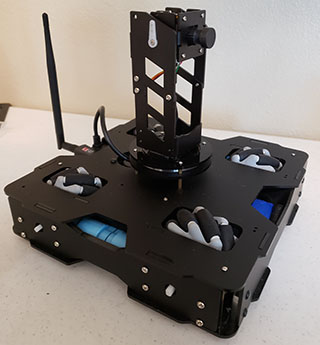
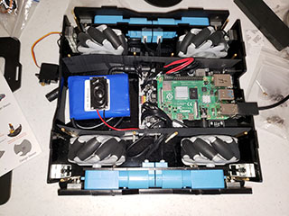

# Raspblock

I am working on assembling and programming a Yahboom Raspblock. This is
a Raspberry Pi mecanum wheel robot with camera.

- [Raspblock Repository](http://www.yahboom.net/study/Raspblock)
- [Raspberry Pi 4](https://www.raspberrypi.com/products/raspberry-pi-4-model-b/)
- [Learn About Mecanum Wheels](https://en.wikipedia.org/wiki/Mecanum_wheel)

## Changes

- 06/17/24 - Bought an authentic PS4 and everything works!

## Code

- ps4_yawhold.py - 06/17/24 (The PS4 controls move the Raspblock forward, backward, left and right. Hooray!)
- ps4_joystick_test.py - 06/17/24 (print the joystick output)
- ps4_test.py - 06/17/24
- buzzer_test.py (Sound the onboard buzzer)
- servo_test.py (Move the camera and tower servo)

## Assembly

06-02-2024: Completely assembled, Pi boots, servo's work!

02-11-2024 Almost have everything together. 

### Purpose
I am an Information Technology Instructor at [Western Nebraska Community College](https://www.wncc.edu). I teach Information Technology, CyberSecurity and Computer Science. Best job ever!

Visit our Facebook page: [Facebook WNCC IT Program](https://www.facebook.com/wnccitprogram/)

### License
 This work is licensed under a <a rel="license" href="http://creativecommons.org/licenses/by-nc-sa/4.0/">Creative Commons Attribution-NonCommercial-ShareAlike 4.0 International License</a>.

Copyright (c) 2024 William A Loring
